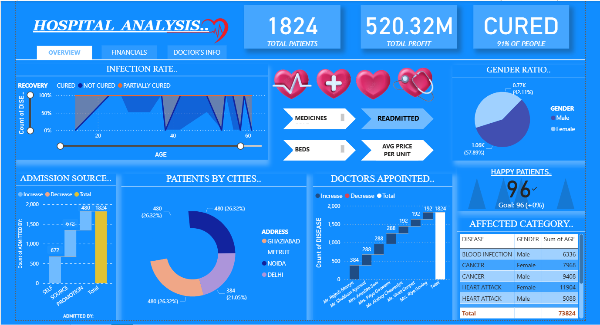

# Healthcare Analytics Dashboard – Power BI

## 📊 Overview
This dashboard analyzes healthcare performance including patient trends, diagnosis categories, operational metrics, and resource utilization.

## 🖼️ Dashboard Preview

  

## 🔍 Insights
- Patient admission trends  
- Hospital resource allocation  
- Diagnosis distribution  
- Financial analysis metrics  

## 🛠 Tools Used
- Power BI Desktop  
- Excel  
- DAX  
- Data Modeling  
